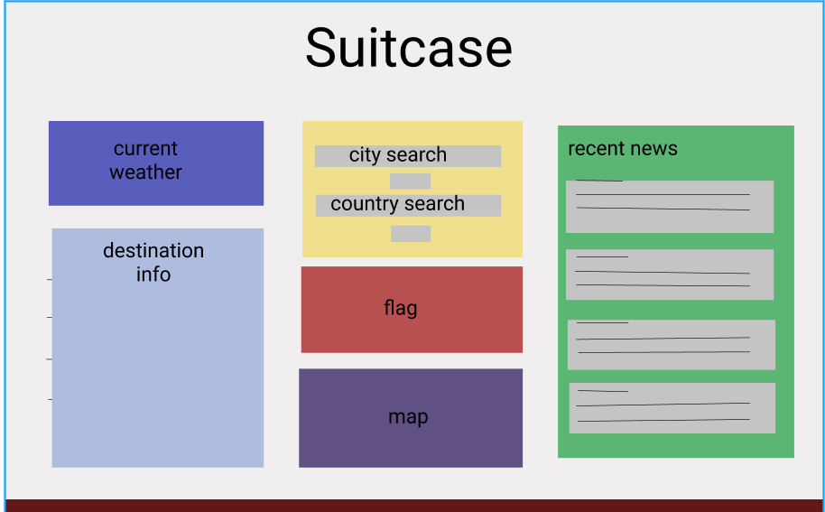

# Project One - Group 4 Proposal

Status: Approved

## Summary

The goal of this project is to build a web application that will display information about a destination upon submission. Say, if an international traveler wanted to learn more about the country that they are traveling to, they can use this application to see the weather forecast, news about the country, basic geographic information, etc. Information about the user's desired destination will be obtained by requesting data from server APIs and projected this data on the webpage.

## Proposed Developer Roles

* Joseph Soria
    * Project Manager, Back End Developer, Front End Developer (supporting)

 * Iyana Medlock
    * Back End Developer, Front End Developer (supporting)

 * Fahad Hai
    * Front End Developer, Back End Developer (supporting)

## Proposed CSS Framework

* Foundation

## Proposed Server-Side APIs

* REST Countries API
* OpenWeather API
* Google Maps API
* Google News API

## Proposed Third-Party APIs

* jQuery
* Dayjs
* Foundation
* Font Awesome

## Link to Project Board

https://github.com/Joeseff6/Suitcase/projects

## Wireframe Sketch

